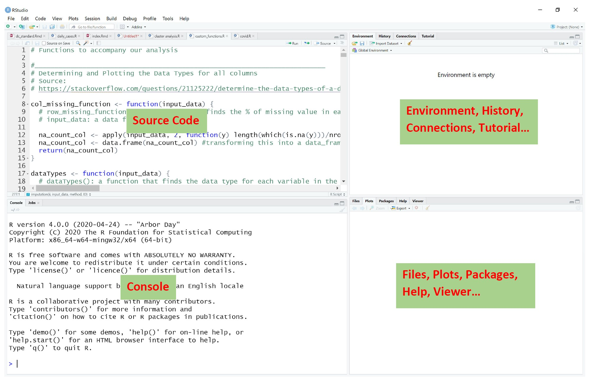
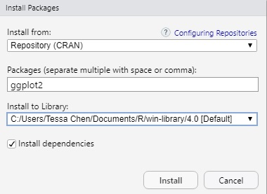
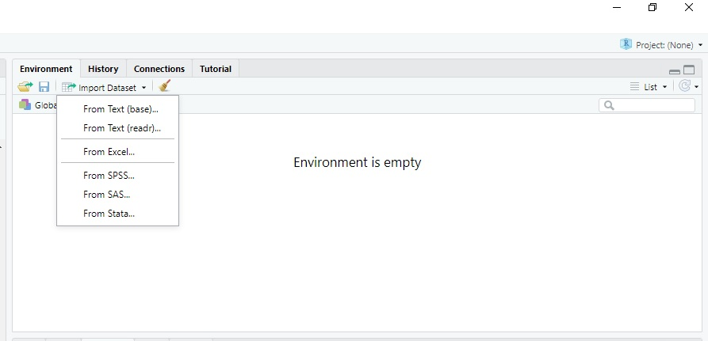

  
```{r setup, include=FALSE}
knitr::opts_chunk$set(echo = TRUE,
                      cache = TRUE,
                      cache.lazy = FALSE,
                      out.width = "100%",
                      warning = FALSE,
                      message = FALSE,
                      progress = FALSE,
                      verbose = FALSE)
```

```{r directory, echo=FALSE}
setwd("I:/Shared drives/R Short Course 2020 Summer/code")
```
## README

We facilitated a mini course of R Learning remotely at the University of Dayton in Summer, 2020.  To the extent possible, the content of the meetings are recorded here.

You can utilize the following single character keyboard shortcuts to enable alternate display modes (@xie2018r):

* A: Switches show of current versus all slides (helpful for printing all pages)

* B: Make fonts large

* c: Show table of contents

* S: Make fonts smaller


# Session 1: Overview for R and RStudio, Basic Syntax and Data Types

## Brief Overview 

In the first session, we will have a short overview of the inferfaces of R and RStudio.  Then we will talk about basic syntax and data types in R. 

- Basic Syntax: 
  - Pound Sign in R
  - Simple Algebra
  - Assignment Operator
  - Parentheses, Brackets \& Curly Brackets
  
- Basic Data Types:
  - Character
  - Factor
  - Numeric
  - Integer
  - Logical
  - Complex
  
## Interface of RStudio

- An Integrated Development Environment (IDE) for R

```{r rstudio, echo=FALSE, fig.align = 'center'}
   
```

## Basic Syntax

In this section, we introduce some basic syntax in R. 

- Pound sign in R

\# symbol is for adding comments and notes to your code.  In any line of your code, anything after it will not be executed. 

```{r poundsign}
# Hello, everyone!
```

- Example of Addition

```{r addition}
3+5
3-5
3 - 5
```

- Example of Multiplication \& Division

```{r multiplication}
3*5
3/5
3 / 5
```

**Note:** you should fine that 3/5 and 3 / 5 generate the same result.  This is because the blank spaces in the code is generally ignored.  

- Assignment Operators: Equal Sign and Arrow in R

```{r arrow}
a <- 8
3 -> b
a
b
```

```{r equal}
a = 8
b = 3
a
b
```

What's difference between them?

```{r diff_arrow_equal, error=TRUE}
mean(x = c(1, 4, 7, 9, 19))
x
mean(x <- c(1, 4, 7, 9, 19))
x
```

In the first case, $x$ is an argument in the function <span Style="color:blue">mean()</span> while the second case assigns a vector a vector $(1, 4, 7, 9, 19)$ to $x$ and then finds the mean value of it. 

<p style="color:red">We should use <- as an assignment operator and = for function arguments! </p>

- Parentheses, Brackets \& Curly Brackets

Parentheses, ( ), are used to call functions; Brackets, [ ], are used to obtain values in a data structure, Curly Brackets, { }, are used to denote a block of code in a function or in a conditional statement.  

Here, we give examples about the use of ( ) and [ ].  The use of curly brackets will be introduced later. 

```{r pars}
w <- c(39, 61, 9, 17, 25, 56, 47, 62, 71, 100, 1, 42) # c() combines objects
median(w) # find the median of w
w[3] # find the value of the third element in w
w[1:2] # find the values of the first and second elements in w
w[2:4] # find the values between the second and the fourth elements in w
w[c(2,5,8)] # only find the values of the second, fifth and eighth elements in w
w[-5] # the fifth element in w is removed
w[w < 50] # only obtain values that satisfy the condition
```

**Note:** c() can concatenate more than just vectors.  We will talk about this later. 


## Basic Data Types

In this section, we introduce the basic data types in R.

- Character
A character object is used to store text, letters, or words (strings) in R.

```{r character}
x <- "Hello"
y <- "World!"
class(x) # we can use class() function to obtain the data type
nchar(x) # use nchar() to count the number of characters
```

**Note:** When defining strings, double quotes " " and single quotes ' ' are interchangeably but double quotes are preferred (and character constants are printed using double quotes), so single quotes are normally only used to delimit character constants containing double quotes @rquotes2020. 

If we want to combine two strings into one string, we can use paste() or paste0() function. 

```{r paste}
paste(x,y)
paste(x,y,sep=",")
paste(x,y,sep=", ")
paste(x, ", ", y)
paste0(x,y)
```

These two functions could be very useful.  Here we give one example. 

```{r paste_example}
allfiles1 <- paste("file_", 1:5)
allfiles2 <- paste("file_", 1:5, collapse = "_")
allfiles3 <- paste("file", 1:5, sep = "_")
allfiles1
allfiles2
allfiles3
```

- Factor

A factor object is used to store categorical / qualitative variables. 

```{r factor}
grade <- factor(c("A", "C", "B", "B-", "A", "C+", "D", "A-", "B+", "C-", "B"))
grade
gender <- c("M", "F", "F", "M", "M", "M", "F", "M", "F")
gender <- as.factor(gender)
class(gender)
levels(gender) # use levels() to find all categories in the variable
length(grade) # use length() to find the length of vectors 
```

- Numeric

A numeric object is used to store numeric data in R.

```{r numeric}
x1 <- 3
x2 <- c(-3.13, 2.47, 6, -1.5, 4.29, 2.72, 1, 0, 3.85)
class(x1)
class(x2)
sum(x2)
max(x2)
min(x2)
range(x2)
round(x2) # round off the values
ceiling(x2) # round up to the nearest integer
floor(x2) # round down to the nearest integer
summary(x2)
```

- Integer 

An integer object is used to store numeric data without decimals.

```{r integer}
x2 <- c(-3.13, 2.47, 6, -1.5, 4.29, 2.72, 1, 0, 3.85)
x3 <- as.integer(x2) # only remain the integers
x3
class(x3)
```

- Logical

A logic object contains only two values: TRUE or FALSE.

```{r logic}
y1 <- -7
y2 <- 11
y1 > y2
y1 == y2  # check if two objects are the same
y1 <= y2
result <- y1 > y2
class(result)
```

- Complex 

A complex object is used to store complex values.

```{r complex, error=TRUE}
sqrt(-1)
1*i
1i
x <- 3+2i
y <- -7i
class(x)
x+y
```

- Create an empty vector

There are some situations that we may want to create an empty vector.  Here is a simple example. 

```{r empty}
x <- c()
y1 <- vector("character", length=3)
y2 <- character(3)
z1 <- vector("numeric", 5)
z2 <- numeric(5)
w <- rep(NA, 2)
x
y1
y2
z1
z2
w
```

- Remark for as.character(), as.integer(), as.numeric(), as.factor() functions

We can use these functions to transform the data type. 

```{r as}
z1 <- as.integer(c(3, 5))
class(z1)
z2 <- as.character(z1) # transform integer object to character
z2
as.numeric(3<8)  # transform logical object to numeric values
as.numeric(3>8)
gender <- factor(c("M", "F", "F", "M", "M", "M", "F", "M", "F"))
as.numeric(gender) # transform levels in the categorical variables to numbers
```

**Note:** as.numeric() function can transform logical object to numeric values: TRUE: 1 and FALSE: 0. 


## More about String \& Vector

In this section, we introduce some useful commends regarding strings and vectors.

- toupper() \& tolower()

<span Style="color:blue">toupper()</span> and <span Style="color:blue">tolower()</span> functions change the case of characters of a string.

```{r allcases}
a <- "Hello, the World!"
toupper(a)
tolower(a)

b <- "Good to see you!"
c(a, b) # combine to vectors

toupper(c(a,b))
```


- substring()

<span Style="color:blue">substring()</span> function is used to obtain parts of a spring. 

Usage: substring(x, first, last)

```{r substring}
substring(a, 8, 10) # extract characters from 2nd to 5th position
```

- print()

<span Style="color:blue">print()</span> function prints its argument and return it invisibly. 

```{r print, error=TRUE}
print("Hello")
print(1)
print(1, 3, 6)
print(c(1, 3, 6))
print(c("Hello!", c(1,3,6)))
print(c("Hello!", 1,3,6))
```

**Note:** If we want to print several objects together, we need to combine them first. 


- grep()

<span Style="color:blue">grep()</span> finds the pattern in a string and returns the indices (positions)

Usage: grep(pattern, string, value=FALSE)

```{r grep}
x <- c("xyz", "xyz", "yxz", "yzx", "zxy", "zyx")
grep("xy", x, value=TRUE) # return values
grep("xy", x) # default: value = FALSE, it returns the indices (positions)
```

- gsub() 

<span Style="color:blue">gsub()</span> finds the pattern in a string and replace every pattern occurrence with replacement in string.

Usage: gsub(pattern, replacement, string)

```{r gsub}
grade
gsub("A", 90, grade)
gender
gsub("F", "Girl", gender)
gsub("M", "Boy", gender)

x <- "abcddefdae"
gsub("ab", "AB", x)
```


# Session 2: Basic Data Structures, Managing Data, Installing and Loading Packages, and Importing data and Writing files


## Brief Overview

In this session, we will introduce two basic data structures: matrix and data frame, installing and loading packages, and importing data and writing files. 


## Matrix

- What are matrices?

A matrix is a rectangular array of numbers or other mathematical objects for which operations such as addition and multiplication are defined [Matrix](https://en.wikipedia.org/wiki/Matrix_(mathematics)){target="_blank"}. 

For example, 

$$M=\left(\begin{array}{cccc} a_{11} & a_{12} & \ldots & a_{1n}\\
a_{21} & a_{22} & \ldots & a_{2n}\\
\vdots & \vdots & \ddots &\vdots\\
a_{m1} & a_{m2} & \ldots & a_{mn}
\end{array}\right)$$

is called a $m\times n$ matrix ($m$ rows and $n$ columns) where $m\times n$ is the dimension of $M$.  In addition, $M[i,j]$ is the element in the $i^{th}$ row and the $j^{th}$ column. 

Usage: matrix(data = NA, nrow = 1, ncol = 1, byrow = FALSE, dimnames = NULL)
       
  + byrow = FALSE indicates the matrix is filled by columns
  + dimnames: NULL or a list of length 2 giving the row and column names respectively. 

We can define matrices directly with numbers assigned in each element. 

```{r matrices1}
# Example 1 
A <- matrix(7:12, ncol=2)
B <- matrix(1:6, nrow=2, ncol=3, byrow=T)
A
B
```


```{r matrices2}
# Example 2
C <- matrix(nrow=2,ncol=3)
C[1,1] <- 1
C[1,2] <- 3
C[1,3] <- 5
C[2,1] <- 4
C[2,2] <- 7
C[2,3] <- 9
C
```


- Extracting Matrix Rows and Columns

In the following, we show how to extract rows or columns in a matrix.

```{r extract1}
z <- matrix(1:12,3,4)
z[1, ] # the first row is extracted 
z[ ,2] # the second column is extracted
z[1,2:3] # the elements on the first row and on either second or third column are extracted. 
```

Then, the following code chunk shows how to exclude rows or columns in a matrix.

```{r exclude}
z[,-c(2,4)] # the second and fourth columns are excluded
z[-3,] # the third row is excluded
z[-1,-5]
```

- General Matrix Operations

There are two multiplication operators for matrices in R.  The general matrix multiplication operator.

The first operator, * , does a simple element by element multiplication up to matrices. The second operator, %*%, performs a matrix multiplication between two matrices.


```{r moperators}
# Example (Matrix addition, Matrix multiplication)
x <- matrix(1:4,2,2)
x + x
x * x
x %*% x
```

- Distinction between Vector and Matrix

One should note that vector and matrix are different data types in R, though a vector can be seen as a special case of a matrix. 

We can use <span Style="color:blue">dim()</span> function in R to check the dimension of a matrix or data frame (we will talk about it soon). 

```{r asmatrix}
a <- 1:3
b <- as.matrix(a) # use as.matrix() to transform a vector to a matrix
dim(a) # check the dimension of a
dim(b)
```

## Data Frame

In general, datasets in R are stored as data frames.  The structure of a data frame is similar to a matrix but the data stored in columns of a matrix can have only the same data type while a data frame can contain multiple data types in multiple columns.  A data frame has column and row names.


- Creating Data Frames & Access Components of a Data Frame

Usage: data.frame(..., row.names = NULL, check.rows = FALSE,
           check.names = TRUE, fix.empty.names = TRUE,
           stringsAsFactors = FALSE)
           

```{r dataframe1}
# Creating Data Frames
names <- c('David', 'John', 'Mary')
quiz.1 <- c(89, 93, 85)
quiz.2 <- c(91, 88, 90)
Grade <- data.frame(names, quiz.1, quiz.2, stringsAsFactors = TRUE)
Grade
str(Grade) # use str() function to know the structure of the data frame
```

We can use either $, [, or [[ operator to access columns of data frame.  Here is a simple example. 

```{r dataframe2}
# extract the first variable
Grade$names
Grade[,1]
Grade[[1]]
```

We can use <span Style="color:blue">colnames()</span> function to obtain all column names of the data. 

```{r colname}
colnames(Grade)
colnames(Grade) <- c("names", "Quiz_1", "Quiz_2")
colnames(Grade)
```

- Matrix-Like Operations

Elements in data frames can be obtained like a matrix by providing index for row and column. 

```{r dataframe3}
Grade[3,2] # the third student's first quiz grade
Grade$names[3] # the third student's name
Grade[1:2,3] # the first two students' second quiz grade
Grade[2,2:3] # the second student's first and second quiz grades
```

- Merging Data Frames

Usage: merge(x, y, by.x, by.y)

  - x: the origin data frame
  - y: the data frame to merge
  - by.x: the column used for merging in x 
  - by.y: the column used for merging in y
  

```{r merge1}
Grade1 <- data.frame(students = c('David', 'Gabby', 'Mary'), 
                    quiz_3=c(88, 92, 85), 
                    stringsAsFactors=TRUE)
Grade1
merge(Grade, Grade1, by.x="names", by.y="students")
```

**Note:** the result after merging two data frames returns only rows found in both x and y data frames.  If we would like to include all rows, we need the additional argument all.x=TRUE. 

```{r merge2}
merge(Grade, Grade1, by.x="names", by.y="students", all.x=TRUE)
```

When we include the rows with no matching rows in the other data frame, NA will be assigned to the corresponding positions. 


## Installing and Loading Packages

The commonly used units that people adopt to share code in R are packages. In general, a package contains code, data, documentation, tests, etc. Most people upload their packages to [CRAN](https://cran.r-project.org/){target="_blank"}, a comprehensive R Archive Network while a few people share their code on [GitHub](https://github.com/){target="_blank"} or other web sites.  It is recommended that you ONLY download packages from CRAN since these packages are well-maintained. 


In order to import packages in RStudio, you need to 

1. know the name of the package.

2. download the package. Here, we introduce two basic methods:

  &emsp; -- Click the **Packages** tab in RStudio (bottom right window) and then click <span style="color:blue">Install</span>, find <span style="color:blue">Install From:</span> and select <span style="color:blue">Repository (CRAN)</span>, type the name of the package in the box under **Packages (separate multiple with space or comma)** and click <span style="color:blue">Install</span>. 

  
```{r cran, echo=FALSE, fig.align = 'center', out.width = "500px"}
   
```

  **Note:** we should leave **Install dependencies** checked so R will download any additional packages needed in order to use some functions or data in the package you are currently downloading. 

  &emsp; -- In the Console window, run **install.packages("package's name")**. 
  
  **Note:** It is essential to put the quotation marks around the package's name.

3. Use <span style="color:blue">library()</span> or <span style="color:blue">require()</span> function to import the package you would like to use.  Here, we show how to install the package <span style="color:red">tidyverse</span> which is designed for data science and how to import it.  

```{r packages, eval=FALSE}
install.packages("tidyverse")
library(tidyverse)
```

**Note:** 

  1. Sometimes, warning messages are given in the Console when installing certain packages indicating that the package was built using an older version of R.  In general, these warnings can be ignored since they are still compatible with newer versions of R.
  
  2. You only need to install a package once when the first time you need it. You can always import the package after you install it. 
  
  3. The main difference between library() and require() functions is library() returns an error if the package doesn't exist while require() returns FALSE and gives a warning. 

## Importing Data and Writing Files

In this section, we introduce two methods of importing data from some commonly used formats and write files.

1. Using the <span style="color:blue">Import Dataset</span> tab in RStudio (on the top right window).

```{r readdata, echo=FALSE, fig.align = 'center', out.width = "800px"}
   
```

2. Using the code.

Since there are many file types, we will focus on two commonly used file types: 
text files and comma separated value files.  We will use the package <span style="color:red">readr</span> which is included in <span style="color:red">tidyverse</span> as it provides a fast and convenient way to read rectangular data (e.g. csv, tsv, and fwf). 

[readr](https://readr.tidyverse.org/){target="_blank"} supports the following file types using the following functions to read files:
  
  - read_csv(): comma separated (CSV) files
  - read_csv2(): semicolon separated files
  - read_delim(): general delimited files
  - read_fwf(): fixed width files
  - read_log(): web log files
  - read_table(): tabular files where columns are separated by white-space.
  - read_tsv(): tab separated files

Some Common arguments in these functions: 
  - file: can be either a path to a file, a connection, or literal data
  - col_names: can be either TRUE, FALSE, or a character of column names

In general, these functions will work well.  We include the path to a file, and we will obtain a tibble which is a modern reimagining of the data frame.  It is much easier to navigate, view, and manipulate the contents of data using a tibble as every row is corresponding to an observation and every column is corresponding with a variable.


The following two code chunks give examples of reading data files.  The following two code chunks give examples of reading data files.  The first data file can be downloaded here: [bike_sharing_data.csv](https://drive.google.com/file/d/12lAWjs0lx1hFSAtkaX9FM1KFAk2BGXx9/view?usp=sharing){target="_blank"}. 


```{r obtaindata1}
library(tidyverse)
df1 <- read_csv("../data/bike_sharing_data.csv")
head(df1) # use head() to read the first six rows of the data
glimpse(df1) # use glimpse() to get a glimpse of the data
```

**Note:** glimpse() is a function included in tidyverse. 

The second data file: <span Style="color:blue">Iris.Data</span> can be obtained from [UCI Machine Learning Repository](https://archive.ics.uci.edu/ml/datasets/Iris){target="_blank"}.

The dataset contains 3 classes of 50 instances each, where each class refers to a type of iris plant.  It has 5 variables: 

1. sepal length in cm
2. sepal width in cm
3. petal length in cm
4. petal width in cm
5. class: Iris Setosa, Iris Versicolour, Iris Virginica

```{r obtaindata2}
df2 <- read_delim("../data/iris.Data", delim=",", col_names = c("sepal_length", "sepal_width", "petal_length", "petal_width", "class"))
glimpse(df2)
```

**Note:** In many programming languages like C, C++, Java, MatLab, Python, Perl, R, a backslash, \\, works as an escape character in strings.  So in these languages, we need to use either slash, /, or double backslash, \\\\, in the string in order to get a single backslash for a path. 

Similarly, [readr](https://readr.tidyverse.org/reference/write_delim.html){target="_blank"} provides the following functions to write files:


  - write_csv(): comma separated (CSV) files
  - write_csv2(): semicolon separated files
  - write_delim(): general delimited files
  - write_excel_csv
  - write_excel_csv2
  - write_tsv: tab separated files

Some Common arguments in these functions: 

  - x: a data frame 
  - path: Path or connection to write to (including the file name).
  - delim: delimiter used to separate values.
  - na: string used for missing values. Defaults to NA.
  - append: if FALSE, the function overwrites existing file. If TRUE, it appends to existing file. A new file will be created if the file does not exist.
  - col_names: If TRUE, write columns names at the top of the file.

```{r writedata, eval=FALSE}
write_csv(df1, "../data/newfile.csv")
```

# Session 3: Basic Graphical Displays

## Brief Overview

In this session, we will use the data <span Style="color:blue">diamonds</span> which contains prices of over 50,000 round cut diamonds to study how to make the following graphical displays.  This data is included in tidyverse. 

- Categorical Data
  - Bar Chart
  - Pie Chart

- Quantitative Data
  - Histogram
  - Boxplot
  - Scatterplot 
  - Line 

Here is a list of common arguments:

  - col: a vector of colors 
  - main: title for the plot
  - xlim or ylim: limits for the x or y axis
  - xlab or ylab: a label for the x axis
  - font: font used for text, 1=plain; 2=bold; 3=italic, 4=bold italic
  - font.axis: font used for axis 
  - cex.axis: font size for x and y axes
  - font.lab: font for x and y labels
  - cex.lab: font size for x and y labels


## Bar Chart

Bar chart is the graphical display good for the general audience. Here we study the distribution of the quality of the cut in the data.

Usage: barplot(height, ...)

```{r bar1, fig.align = 'center'}
barplot(table(diamonds$cut))
barplot(table(diamonds$cut), col="blue", main="Distribution of Diamond Cut", horiz=TRUE, xlab="Number of Diamonds")
```

**Note:** 

1. One can use names to change the names appearing under each bar. For example, names=c("F", "G", "VG", "P", "I").

2. We can use RGB color code to assign colors. 

```{r bar2, fig.align = 'center'}
barplot(table(diamonds$cut), col="#69b3a2", main="Distribution of Diamond Cut", xlab="Number of Diamonds", names=c("F", "G", "VG", "P", "I"))
```

## Pie Chart

Similarly, we can use pie chart to study the distribution of the diamond color, from D (best) to J (worst). 

```{r pie1, fig.align = 'center'}
pie(table(diamonds$color), main="Distribution of Diamond Color")
```

The following code chunk shows an advanced setting. 

```{r pie2, fig.align = 'center'}
H <- table(diamonds$color)
percent <- round(100*H/sum(H), 1) # calculate percentages
pie_labels <- paste(percent, "%", sep="") # include %
pie(H, main="My Best Piechart", labels=pie_labels, col = 2:8)
legend("topright", c("D","E","F","G","H","I","J"), cex=0.8, fill=2:8)
```

**Tip:** Use color palette to choose colors. 


## Histogram 

Histogram is used when we want to study the distribution of a quantitative variable. Here we study the distribution of the prices in the data.

```{r histogram, fig.align = 'center'}
hist(diamonds$price, main="Distribution of Price of Diamonds", xlab="Price")
```

We can find that the distribution of the price is unimodal (one peak), skewed to the right, and has no outliers. 


## Boxplot

Here we talk about another graphical display that can be used to study the distribution of a quantitative variable: box and whisker plot (boxplot). 


```{r boxplot1, fig.align = 'center'}
boxplot(diamonds$price, xlab="Price", ylab="Dollars")
```

In general, a boxplot is used When we want to compare the distributions of several quantitative variables.  In the following we study the distribution of price of diamonds among different quality of the cut. 

In order to know how this can be done, we need to know how to define a formula in R. 

Useage: A ~ B

  - A: response variable
  - B: explanatory variables

```{r boxplot2, fig.align = 'center'}
boxplot(diamonds$price~diamonds$cut)
```

```{r boxplot3, fig.align = 'center'}
boxplot(diamonds$price ~ diamonds$cut, main="Distribution of Price of Diamonds among the Quality of the Cut", xlab="Quality", ylab="Price", col=11:15, cex.lab=1.25, cex.axis=1.25)
```

We can use the argument <span Style="color:blue">data</span> to indicate that variables used are from a given data.

```{r boxplot4, fig.align = 'center'}
boxplot(price ~ cut + color, data = diamonds, main="Distribution of Price of Diamonds among the Quality of the Cut", xlab="Quality", ylab="Price",  cex.lab=1.25, cex.axis=1.25)
```

The above plot is only for the demonstration purpose. We can see that not names for all categories are shown on the plot which should be improved. 

## Scatterplot

When we want to study the relationship of two quantitative variables, a scatterplot can be used.  Here we study the relationship of the diamond price against its weight. 

```{r scatter}
plot(price ~ carat, data=diamonds, xlab="Weight of Diamond", ylab="Price of Diamond")
```


## Line Plot

When we want to show how a quantitative variable changes over a period of time, a line plot can be used.  Line plots can also be used to compare changes over the same period of time for several groups.  Since diamonds dataset is not time series data, it is not appropriate to use line plot.  In the following code chunk, we create a data frame using the forecasted highest temperatures from July 13 to July 22 ([The Weather Channel](https://weather.com/){target="_blank"}).  

In order to graph a line plot, we need to know two additional arguments 

  - type: "p" to draw only points; "l" to draw only lines; "o" to draw both points and lines
  
  - lty: line types. 0=blank; 1=solid; 2=dashed; 4=dotdash, 5=longdash, 6=twodash
  

```{r line1}
Date <- 13:22
Dayton_OH <- c(84, 86, 91, 89, 89, 91, 92, 91, 91, 91)
Houston_TX <- c(100, 97, 96, 94, 94, 94, 93, 93, 92, 91)
Denver_CO <- c(95, 85, 89, 96, 97, 96, 92, 91, 95, 96)
Fargo_ND <- c(86, 80, 84, 87, 90, 87, 83, 84, 87, 89)
df <- data.frame(Date, Dayton_OH, Houston_TX, Denver_CO, Fargo_ND)

plot(Date, Dayton_OH, type="o", col="blue", xlab="Date in July", ylab="Highest Temperature", ylim=c(80, 100))
lines(Date, Houston_TX, type="o", col="red")
lines(Date, Denver_CO, type="o", col="purple")
lines(Date, Fargo_ND, type="o", col="darkgreen")
```


# Session 4: Data Manipulation

## Brief Overview

In this session, we will talk about data manipulation using R package <span Style="Color:red">tidyverse</span>.  This package contains a collection of R packages that help us doing data management & exploration.  The key packages in <span Style="Color:red">tidyverse</span> are:

  - dplyr: data manipulation
  - ggplot2: data visualization 
  - purr: functional programming toolkit
  - readr: read data and write files
  - tibble: simple data frame
  - tidyr: data management

In this session, we will focus on the following key functions in <span Style="Color:red">dplyr</span> using the [bike_sharing_data.csv](https://drive.google.com/file/d/12lAWjs0lx1hFSAtkaX9FM1KFAk2BGXx9/view?usp=sharing){target="_blank"}.

  - arrange()
  - filter()
  - group_by()
  - mutate() 
  - select()
  - summarize()


  
## Pipe

In other to handle the data processing well in data science, it is essential to know the use of pipes. Pipes are great tool for presenting a sequence of multiple operations and therefore, pipes increase readability of the code.  The pipe, %>%, is from the package <span Style="color:red">magrittr</span> and it is loaded automatically when tidyverse is loaded. 

The logic when using pipe: object %>% function1 %>% function 2.... 

First, we load the package, check conflict functions and import the bike_sharing_data.csv. 

```{r loading_packages}
library(tidyverse)
library(conflicted)
conflict_prefer("select", "dplyr")
conflict_prefer("filter", "dplyr")
df <- read_csv("../data/bike_sharing_data.csv")
```

Now we need to understand each variable before we move on. In this data, we have 12 variables ([UCI Machine Learning Repository](https://archive.ics.uci.edu/ml/datasets/bike+sharing+dataset){target="_blank"}). 

  - datetime: date and time of the event
  - season: 1:spring, 2:summer, 3:fall, 4:winter
  - holiday: 1: holiday, 0: not holiday
  - workingday: 1: neither weekend nor holiday, 0: otherwise
  - weather
  
    1: Clear, Few clouds, Partly cloudy, Partly cloudy
    
    2: Mist + Cloudy, Mist + Broken clouds, Mist + Few clouds, Mist
    
    3: Light Snow, Light Rain + Thunderstorm + Scattered clouds, Light Rain + Scattered clouds
    
    4: Heavy Rain + Ice Pallets + Thunderstorm + Mist, Snow + Fog
    
  - temp: Normalized temperature in Celsius
  - atemp: Normalized feeling temperature in Celsius
  - humidity: Normalized humidity
  - windspeed: Normalized humidity
  - casual: count of casual users
  - registered: count of registered users
  - count: count of total rental bikes including casual and registered 


## arrange()

<span Style="color:blue">arrange()</span> is used when we want to sort a dataset by a variable. If more variables are specified for sorting a dataset, the variables entered first taking priority over those come later.  The following code chunk gives an example that sorts the bike_sharing_data by its temperature and humidity so we can compare the distribution of count in the data.  

```{r arrange}
df1 <- df %>% arrange(temp, humidity)
df1[1:10,c("datetime","temp", "humidity", "count")] # print the first 10 rows to check the result
```

Some potential questions we may be interested: is there any association between the count of bike sharing and the temperature or the humidity or both? 

**Note:** 

  1. We can save the data frame back to the original data frame after sorting the data.
  2. Use <span Style=:color:blue>desc()</span> for sorting data via descending order. For example, <span Style=:color:blue>df %>% arrange(temp, desc(humidity))</span>

## filter()

<span Style="color:blue">filter()</span> is used when we want to filter out entries in a column based o a logical condition. If we would like to study how popular the bike sharing program (count) is during when we have holidays, we can use filter() to filter out data for holidays. 

```{r filter1}
table(df$holiday)
df2 <- df %>% filter(holiday==1)
df2$count[1:10]
summary(df2$count) # find the summary statistics for count for holidays 
summary(df$count) # the summary statistics for the original data
```

What did you find by comparing the summary statistics between holidays' data and the original data?

Here is an advanced example that shows how we can filter out data for holidays in season 2 and the temperature is higher than 20 degrees. 

```{r filter2}
df3 <- df %>% filter(holiday==1, season==2, temp>20)
dim(df3)
summary(df3$count)  
summary(df2$count) 
```

Or we can filter out data for holidays in season 2 or season 3 and the temperature is higher than 20 degrees. 

```{r filter3}
df4 <- df %>% filter(holiday==1, season==2|season==3, temp>20) 
dim(df4)
summary(df4$count)  
summary(df3$count) 
```

## group_by() \& summarize()

<span Style="color:blue">group_by()</span> is used to group rows by one or more variables, giving priority to the variable entered first.  For example, if we would like to study the weather effect on the bike sharing program, we can group rows by weather categories. 

```{r groupby1}
table(df$weather)
df5 <- df %>% group_by(weather)
df5
```

The result shows the original data but indicates a group, weather, in our example.  In general, <span Style="color:blue">summarize()</span> function is used together with <span Style="color:blue">group_by()</span> as we group rows for some purposes.  For example, we can study the average measures (temp, atemp, humidity, windspeed) for the quantitative variables with different weather condition. 

```{r groupby2}
df6 <- df %>% group_by(weather) %>% summarize(ave_temp = mean(temp), 
                                              ave_atemp = mean(atemp),
                                              ave_humidity = mean(humidity),
                                              ave_windspeed = mean(windspeed),
                                              cases = n())

df6
```

## mutate()

<span Style="color:blue">mutate()</span> is used when we would like to add a new variable / column using the other variables in the data.  The following code chunk shows how we convert the temperature (temp) and feeling temperature (atemp) from Celsius to Fahrenheit using the equation $$F = \frac{9}{5}\times C+32$$
in the data and add two columns to the dataset. 

```{r mutate1}
df7 <- df %>% mutate(F_temp=9/5*temp+32, F_atemp=9/5*atemp+32)
glimpse(df7)
```

We also can use a logical statement to add a new variable in the data. 

```{r mutate2}
df8 <- df7 %>% mutate(temp_level=ifelse(F_temp>85, "high", "low"))
glimpse(df8)
table(df8$temp_level)
```

## select()

<span Style="color:blue">select()</span> is used when we would like to obtain several variables in the data.  For example, if we would like to focus on the study of the quantitative variables in the bike sharing data, we can use the <span Style="color:blue">select()</span> function to include all quantitative variables. 

```{r select1}
df9 <- df %>% select(temp, atemp, humidity, windspeed, casual, registered, count)
glimpse(df9)
```

This action is equivalent to dropping other variables in the data. 

```{r select2}
df10 <- df %>% select(-c(datetime, season, holiday, workingday, weather))
glimpse(df10)
```

## Other Useful functions

In this subsection, we talk about other useful functions. 

### drop_na() function

<span Style="color:blue">drop_na()</span> is used when we would like to drop rows containing missing values.  Since bike sharing data has no missing values, the R built-in data <span Style="color:blue">airquality</span> is used here.  First, we can use <span Style="color:blue">sum()</span> and <span Style="color:blue">is.na()</span> functions together to check if there is any missing values in the data. 

```{r dropna1}
sum(is.na(df)) # returns 0 if there is no missing values
sum(is.na(airquality))   
```
We can find that there are `r sum(is.na(airquality))` missing values in the data.  Now we can use drop_na() to drop rows containing missing values.

```{r dropna2}
df_air <- airquality %>% drop_na()
sum(is.na(df_air))
```


### Mutate Multiple Columns

Here we introduce a family of mutate related functions: <span Style="color:blue">mutate_all()</span>, <span Style="color:blue">mutate_at()</span>, <span Style="color:blue">mutate_if()</span>. 

  - <span Style="color:blue">mutate_all()</span> is used when we want to edit all columns. 
    - Usage: mutate_all(data, .funs, ...)

The following code chunk shows how we can scale each variable ($\frac{x-\bar{x}}{s_x}$, $\bar{x}$ is the sample mean and $s_x$ is the corresponding standard deviation) in the data <span Style="color:blue">airquality</span>. 

```{r mutateall}
air_scale <- airquality %>% mutate_all(scale)
```

  - <span Style="color:blue">mutate_at()</span> is used when we want to edit specific columns. 
    - Usage: mutate_at(data, .vars, .funs, ..., .cols = NULL)

The following code chunk shows how we can transform the data types of season, holiday, workingday, and weather to factor in the bike sharing data.

```{r mutateat}
glimpse(df) # check the original data structure again
df11 <- df %>% mutate_at(c("season", "holiday", "workingday", "weather"), as.factor)
glimpse(df11) # check the new data structure 
```

  - <span Style="color:blue">mutate_if()</span> is used when we want to edit specific columns with a predicate function.
    - Usage: mutate_if(data, .predicate, .funs, ...)

The following code chunk shows how we can scale the quantitative variables in the bike sharing data and round values to the first decimal place. 

```{r mutateif1}
df11 <- df11 %>% mutate_if(is.numeric, scale) %>% mutate_if(is.numeric, round, digits = 1)
df11
```

**Note:** Why Scaling or Standardizing values?

1. "How unusual is a value/observation?" The answer depends on the units of measurement. 

2. Variables measured at different scales don't contribute equally to the analysis.

# Session 5: Data Exploration & Visualization 

## Brief Overview

In this session, we will introduce one data exploration package: <span Style="color:red">DataExplorer</span> and two data visualization packages: <span Style="color:red">ggplot2</span> and <span Style="color:red">plotly</span>. 

We will use the secondary data posted by [The COVID Tracking Project](https://covidtracking.com/data){target="_blank"}, which is a volunteer group assembling data organized by the Atlantic.  The data contains the summary COVID-19 information daily in the United States.  First, we load necessary packages and import the data. 


```{r covid19}
library(tidyverse)
library(DataExplorer)

df_states <- read_csv("https://covidtracking.com/api/v1/states/daily.csv")
glimpse(df_states)
```

The dataset contains `r nrow(df_states)` observations of `r ncol(df_states)` variables up to `r date()`. 

## Data Exploration with R Package: DataExplorer

In data science, it is important to get to know your data before advanced modeling or further analysis. We should understand what the data are about, what variables we have, the size of the data, how many missing values, what is the data type of each variable, any possible relationships between variables and anything unusual or interesting in the data.

First, we check the basic description for the COVID-19 data using the function <span Style="color:blue">plot_intro()</span> in the package <span Style="color:red">DataExplorer</span>. 

```{r basic, fig.align = 'center'}
plot_intro(df_states)
```

Then, we study the distribution of missing values in the COVID-19 data using the function <span Style="color:blue">plot_missing()</span> in the package <span Style="color:red">DataExplorer</span>.

```{r missingdist, fig.align = 'center'}
plot_missing(df_states)
```


Since there are `r ncol(df_states)` variables and some information is beyond interest here, we will focus on the following variables for the data exploration as the other variables depend on some of these variables.

  - date: date of the record
  - state: states in the US
  - totalTestResultsIncrease: daily increase test results
  - positiveIncrease: daily increases increase cases
  - negativeIncrease: daily increases negative cases
  - deathIncrease: daily increases death cases
  - hospitalizedIncrease: daily increases hospitalized patients
  - death: total number of death up to date
  
```{r COVID19_subset} 
df_states <- df_states %>% select(c(date, state, totalTestResultsIncrease, positiveIncrease, negativeIncrease, deathIncrease, hospitalizedIncrease, death))
glimpse(df_states)

df_states$date <- df_states$date %>% as.factor() # change the data type for date
```


Now, we study the frequency distribution of all categorical variables in the data using the function <span Style="color:blue">plot_bar()</span> in the package <span Style="color:red">DataExplorer</span>. 

```{r EDA_cat, fig.align = 'center'}
plot_bar(df_states, maxcat=56)
```

Since we only have one categorical variable: state in the data, the above figure shows the frequency distribution of state in the COVID-19 data. 

The following code shows the distribution of sum of deathIncrease by states. 

```{r EDA_bar1, fig.align = 'center'}
plot_bar(df_states, with="deathIncrease", maxcat=56)
```

Next, we study the distribution of all quantitative variables in the data using the function <span Style="color:blue">plot_histogram()</span> in the package <span Style="color:red">DataExplorer</span>.

```{r EDA_num, fig.align = 'center'}
plot_histogram(df_states, ncol=3) 
```

We study the distributions of positiveIncrease and deathIncrease with respect to states individually using the function <span Style="color:blue">plot_boxplot()</span> in the package <span Style="color:red">DataExplorer</span>.

```{r EDA_boxplot, fig.align = 'center'}
plot_boxplot(df_states %>% select(c(state, positiveIncrease, deathIncrease)), by = "state")
```

We can study the association between any quantitative variables with a given response variable in the data using the function <span Style="color:blue">plot_scatterplot()</span> in the package <span Style="color:red">DataExplorer</span>.  Here, we study the association between death and other quantitative variables in the COVID-19 data. In order to reduce the running time, we only sample 1000 rows from the data.  

```{r EDA_scatterplot1, fig.align = 'center'}
plot_scatterplot(df_states %>% drop_na(), by = "death", sampled_rows=1000)
```

**Note:** We should note that the variable: date is not a quantitative variable. 

```{r EDA_scatterplot2, fig.align = 'center'}
plot_scatterplot(df_states %>% filter(state=="OH") %>% select(-c(state)) %>% drop_na(), by = "death", ncol=2)
```

The above figure only shows the association between death and other quantitative variables in the Ohio COVID-19 data. 


We can check the correlation of all quantitative variables in the data using the function <span Style="color:blue">plot_correlation()</span> in the package <span Style="color:red">DataExplorer</span>.

```{r EDA_corr, fig.align = 'center'}
plot_correlation(df_states %>% select(-c(date,state)), cor_args = list( "use" = "complete.obs"))
```

In you are new to data exploration and have no ideas about where to start. <span Style="color:blue">create_report()</span> function in the package <span Style="color:red">DataExplorer</span> can help to create a report for the data exploration of the data.  
 
```{r EDA_report, eval=FALSE}
create_report(df_states %>% filter(!(state %in% c("DC", "AS", "GU", "MP", "PR", "VI"))), output_file = "report.html", output_dir = "I:/Shared drives/R Short Course 2020 Summer/code")
```

**Note:** Use <span Style="color:blue">help("create_report")</span> to find the usage of <span Style="color:blue">create_report()</span>. 


## Data Visualization with R Package: ggplot2

While we can use the built-in functions in the base package in R to obtain plots, the package <span Style="color:red">ggplot2</span> creates advanced graphs with simple and flexible commands. 

We will continue using the secondary COVID-19 data to show the use of different graphic displays.  First, we group the data by the variable: state and find the summarize information for each state. 

```{r DV_data}
df_DV <- df_states %>% group_by(state) %>% summarize(
  Positive = sum(positiveIncrease),
  Negative = sum(negativeIncrease), 
  Death = sum(deathIncrease),
  Hospitalized = sum(hospitalizedIncrease))
DT::datatable(df_DV)
```

### Grammar of Graphics

The basic idea of creating plots using <span Style="color:red">ggplot2</span> is to specify each component of the following and combine them with <span Style="color:blue">+</span>. 

- data: dataset used
- aesthetics: select variables to be plotted
- geometric object: the visual elements
  - geom_bar()
  - geom_boxplot()
  - geom_histogram()
  - geom_line()
  - geom_point()
- labs: assign title, subtitile, caption, x & y labels
- theme: customize titles, labels, fonts, background, gridlines, and legends
- faceting: split one plot into multiple plots based on a categorical variable in the data

**Note:** 

  1. We only list some key components here.

  2. See [Modify Components of A Theme](https://ggplot2.tidyverse.org/reference/theme.html){target="_blank"} and [Complete Themes](https://ggplot2.tidyverse.org/reference/ggtheme.html){target="_blank"} for more details about the use of theme.   

### ggplot() function

<span Style="color:blue">ggplot()</span> function plays an important role in data visualization as it is very flexible for plotting many different types of graphic displays. 

The logic when using <span Style="color:blue">ggplot()</span> function is: ggplot(data, mapping) + geom_function().

First, we study the distribution of confirmed cases of COVID-19 in the United States up to `r Sys.Date()`.

```{r DV_histogram1, fig.align = 'center'}
ggplot(data = df_DV, aes(x = Positive)) + geom_histogram() 
```

The following code chunk shows an improved version of the histogram from the able histogram. 

```{r DV_histogram2, fig.align = 'center'}
p1 <- ggplot(data = df_DV, aes(x = Positive)) + geom_histogram(fill="#20B2AA") + 
  labs(x = "Confirmed Cases", title = "Distribution of Confirmed Cases of COVID-19 in the United States") +
  theme(axis.text.x = element_text(size = 12),
        axis.text.y = element_text(size = 12),  
        axis.title.x = element_text(size = 12),
        axis.title.y = element_text(size = 12))

p1
```

Then, we study the total number of confirmed cases in each state in the COVID-19 data. 

```{r DV_bar, fig.align = 'center'}
options(scipen=10000) # put a high number so that R doesn't switch numbers to scientific notation

p2 <- ggplot(data = df_DV, aes(x = state, y = Positive)) + geom_bar(stat = "identity")

p2
```

Now we study the distribution of daily increased confirmed cases of each state using boxplots. 

```{r DV_boxplots, fig.align = 'center'}
p3 <- ggplot(data = df_states, aes(x = state, y = positiveIncrease)) +
    geom_boxplot() + 
  labs(title = "Distribution of Daily Increased Confirmed Cases of Each State", y = "Confirmed Cases") + 
  theme(axis.title.x = element_text(size = 14),
        axis.title.y = element_text(size = 14))
p3
```

In addition, the relationship between total number of death and confirmed cases in each state is studied using a scatterplot. 

```{r DV_scatter, fig.align = 'center'}
p4 <- ggplot(data = df_DV, aes(x = Positive, y = Death)) + geom_point(col="#20B2AA") +
  labs(y = "Death in Each State", x = "Confirmed Cases of COVID-19 in Each State")

p4
```

We can find that the relationship between these two variables are somehow linear.  If we would like to fit the data with a simple linear model using these two variables, <span Style="color:blue">lm()</span> can be used.  The following code chunk shows how we can fit the data with a simple linear model using total number of death and confirmed cases in each state and add the linear line to the scatterplot. 

$$\widehat{Death} = b_0 + b_1 \times Positive$$

```{r DV_linear, fig.align = 'center'}
df_DV$pred.death <- predict(lm(Death ~ Positive, data = df_DV)) # add the prediction from the linear model

p5 <- ggplot(data = df_DV, aes(x = Positive, y = Death)) + geom_point(col="#20B2AA")

p5 + geom_line(aes(y = pred.death))
```

Since we only have one categorical variable: state in the data and this variable contains 56 categories, it is not ideal to use this data to show the use of facet. Here, we use the data set <span Style="color:red">diamonds</span> in the R package <span Style="color:red">tidyverse</span> to show how we can split one plot into several plots by a categorical variable. 

```{r DV_facet, fig.align = 'center'}
ggplot(data = diamonds, aes(x = carat , y = price)) + geom_point() + facet_wrap(facets = vars(cut))
```

In the end of this section, we talk about how we can use <span Style="color:blue">ggplot()</span> function to obtain a map. In order to do this, we need another R package: <span Style="color:red">maps</span>. 

The following steps are recommended when we would like to create an United State map with the corresponding information in the data, 

1. Obtain the longitude and latitude of each state using <span Style="color:blue">map_data()</span> function. You can use this function to obtain the longitude and latitude of each state of each county in the United States as well. 

2. Mutate joins add columns from our data (df_DV) to the state map data using <span Style="color:blue">left_join()</span> function. We need to make sure that names for each state are consistent in both data. (For example, our computers don't know that OH is the same as Ohio or ohio.)

3. Use <span Style="color:blue">ggplot()</span> and <span Style="color:blue">geom_polygon()</span> functions to obtain a basic map first. 

4. Improve the map you obtain in the previous step. 

 
```{r DV_map1, fig.align = 'center'}
library(maps)

# Retrieve the states map data 
state_map <- map_data("state")

# We need to match the state column in our data with the "region" column in state_map
df_DV <- df_DV %>% mutate(region = tolower(state.name[match(df_DV$state, state.abb)])) 

# merge state_map data with df_DV data
death_map <- left_join(state_map, df_DV, by = "region") 

# Create the map
p6 <- ggplot(death_map, aes(x = long, y = lat, group = group)) +
  geom_polygon(aes(fill = Death), color = "white")
p6
```

In the following, we show an improved version of the map from the above map. 

```{r DV_map2, fig.align = 'center'}
state_location <- data.frame(state = state.abb, long = state.center$x, lat = state.center$y)
new_death_map <- left_join(state_location, df_DV, by = "state")

p7 <- ggplot(death_map, aes(x = long, y = lat)) +
  geom_polygon(aes(group = group, fill = Death), color = "black") 

p7 + geom_text(aes(label = paste0(state, "\n ", Death)), data = new_death_map, color = "black", size = 3, fontface=3, hjust=0.5, vjust=0.5) +
  scale_fill_continuous(low ="#ade8f4", high = "#0077b6") +
  theme(legend.position="none", axis.text.x = element_blank(),
        axis.text.y = element_blank(),  
        axis.title.x = element_blank(),
        axis.title.y = element_blank())

# fontface allows values: 1(normal), 2(bold), 3(italic), 4(bold.italic)
```

## Data Visualization with R Package: plotly

The R package <span Style="color:red">plotly</span> can be used to make interactive graphic displays very easy when we already know how to use <span Style="color:blue">ggplot()</span> to create graphs. 

The following code chunk shows the interactive plots corresponding to the figures we have created in the previous section. 


```{r plotly1, fig.align = 'center'}
library(plotly)
ggplotly(p1)
ggplotly(p2)
ggplotly(p3)
ggplotly(p4)
ggplotly(p5)

p8 <- ggplot(death_map, aes(x = long, y = lat, group = group, text = state)) +
  geom_polygon(aes(fill = Death), color = "white") + 
  labs(title="Distribution of COVID-19 Death in the United States")

ggplotly(p8, width=1440, height=900)
```

# Session 6: Conditional Statements, Functions \& Loops

## Brief Overview

In this session, we will introduce the basic data type: list, the use of conditional statements, creation of functions, and loops. 

## List

When data contains several elements that have different lengths / dimensions or types, a list can be used to store the information. The following code chunk shows how we can create a list using <span Style="color:blue">list()</span> function. 

```{r list}
states <- sample(state.abb, 5) # sample 5 states from the United States
names <- c('David', 'John', 'Mary')
quiz.1 <- c(89, 93, 85)
quiz.2 <- c(91, 88, 90)
Grade <- data.frame(names, quiz.1, quiz.2, stringsAsFactors = TRUE)
Y <- list(states, Grade, "Hello", 3)
Y
```

We can use <span Style="color:blue">names()</span> to assign a name for each component in the list. 

```{r list_names}
names(Y) <- c("State", "Grade", "Text", "Number")
```

Then we can obtain values in the list very easy. 

```{r list_values}
Y$State
Y[[1]] # obtain the object stored in the first component of the list
Y$Grade$quiz.1 # this returns the quiz.1 grade in the second compoent of the list
Y[[2]][,2]
Y$Grade$quiz.2[3] # this returns the third person's (Mary) quiz 2 grade
Y[[2]][3,3] # consistent with Y$Grade$quiz.2[3]

```


## Conditional Statements

Conditional statements can be very helpful when we only want to execute the commends under certain conditions. 

**if statement:**

if (cond1==true) { 

  &emsp; cmd
  
}

The following code chunk shows a simple example that examines a number is odd number or not. 

```{r cond1}
x <- 11

if (x%%2 == 1){
  print(paste(x, "is an odd number."))
}
```

**if ... else statement:**

if (cond1==true) { 

  &emsp; &emsp; cmd1 
  
  &emsp; } else { 
  
  &emsp; &emsp; cmd2 
  
}

Here is an improved version of the previous example. 

```{r cond2}
x <- 11

if (x%%2 == 1){
  print(paste(x, "is an odd number."))
}else{
  print(paste(x, "is not an odd number."))
}
```

When the logical statement is simple and short, it is convenient to use <span Style="color:blue">ifelse()</span> function. 


**ifelse statement:**

ifelse(test, true_value, false_value)

In the following code chunk, we sample 10 values from 1, 2, ..., 100 with replacement and check if these 10 values are odd or even numbers. 

```{r ifelse}
x <- sample(1:100, 10)
ifelse(x%%2==1, "Odd", "Even")
```

## Creation of Functions

While we can use lots of functions in the R packages, there are some situations that we may want to define a function by ourselves.  Using functions make our code well-organized and readable as well. 

**Function Structure:**

function_name <- function(arg1, arg2, ...) { 

  &emsp; function body 

}

In the following code chunk, we define a function to check if a value is an even number or odd number. 

```{r function}
check_numbers <- function(n){
  if (n%%2 == 1){
    return(paste(n, "is an odd number."))
  }else{
    return(paste(n, "is an even number."))
  }
}

check_numbers(10)
```


**Question: Can a function call itself?**

Yes!! It is called a recursive function.
(A function within a function)

All recursive algorithms have the following steps:

1.	Base step (when to stop)

2.	Work toward Base step

3.	Recursive call

In the following code chunk, we write a recursive function that computes $a^n$ if $n$ is a nonnegative integer and $a$ is nonzero.

```{r power}
# Example (recursive power function)

pow <- function(a, n){
  if (n == 0){
    return(1)
  } else {
    return(a*pow(a,n-1))
  }
}

pow(2,10) # find 2^10
```

Here is another example that computes the $n$th Fibonacci Number using a recursive function. 

```{r fibonacci}
# Example (Find the nth Fibonacci Number)

Fib <- function(n){
  if (n == 0 || n == 1){
    return(n)
  } else{
    return(Fib(n-1)+Fib(n-2))
  }
}

Fib(20) # find the 100th Fibonacci number
```

## Loops

Loops can be used when repetitive operations are needed. Using loops helps to make the code more readable. However, programming in R is particularly slow when multiple loops are used. Writing pseudo code to plan your algorithm may help to reduce the number of loops needed in the computation. 

### for() Loops

<span Style="color:blue">for()</span> loops are used for general purposes. This means we should know the number of iterations needed. 

**for loop statement:**

for (variable in sequence) { 

  &emsp; statements
    
}

The following code chunk shows how we can find the answer of $1\times 2 + 2\times 3 + \cdots + 398 \times 399 + 399\times 400$ using a <span Style="color:blue">for()</span> loop.

```{r forloop1}
# set up the timer
t0 <- proc.time()
total <- 0
for (i in seq(1,399)){
  total <- total+i * (i+1)
}
total

# print the time used to obtain the answer
proc.time()-t0 
```


### while() Loops

A <span Style="color:blue">while()</span> loop is recommended when the number of iterations in the loop is unknown. For example, if we want to find a numerical solution of $sin(x) = x + 1$ with the error less than 0.0001, we can use the <span Style="color:blue">while()</span> loop to find the solution.  

**while loop statement:**

while (condition) {

  &emsp; statements

}

```{r whileloop}
# Example (Application of Fix point theorem)
# We want to find a solution for sin(x)-1-x=0
# Define the function f(x) = sin(x)-1

find_solution <- function(x) sin(x)-1
precision <- 0.0001
step <- 0 
x0 <- 0.5
error <- 1

# the while loop will be executed when the error is higher that the precision and the step is less than 100

while (error > precision && step < 100){
  xn <- find_solution(x0)
  error <- abs(xn-x0)
  x0 <- xn 
  step <- step + 1
}

if (step == 100){
  print('We can not find the root with 100 iterations.')
}else{
  print(paste('The root of sinx = x + 1 is about ', x0))
  print(paste('It takes ', step, 'iterations.'))
}
```

## Advanced Examples

In this section, we show two advanced examples for computing fractals from iterated function systems ([Fern Fractal](http://krazydad.com/bestiary/bestiary_fern.html){target="_blank"}). 

The first example shows fractal fern. 

```{r fig.align="center"}
a <- c(0, 0.85, 0.2, -0.15)
b <- c(0, 0.04, -0.26, 0.28)
c <- c(0, -0.04, 0.23, 0.26)
d <- c(0.16, 0.85, 0.22, 0.24)
e <- c(0, 0, 0, 0)
f <- c(0, 1.6, 1.6, 0.44)

numits <- 2000 # number of iterations
x <- 0
y <- 0

par(bg="black") # change the color for background 

plot(seq(-2, 10, by = 0.1), seq(-2, 10, by = 0.1), type = "n", 
     main = "fractal fern")

for (n in seq(1,numits)){
  k <- sample(1:4, size = 1, replace = TRUE, prob = c(0.01, 0.85, 0.07, 0.07))
  newx <- a[k]*x + b[k]*y + e[k]
  newy <- c[k]*x + d[k]*y + f[k]
  x <- newx
  y <- newy
  if (n>10){
    points(x+3,y, col = "green", cex=0.5, pch=20)
  }
}
```

Here is another example for fractal tree. 

```{r fractal_tree, fig.align="center"}
# Another Example (Fractal Tree)

a <- c(0, 0.42, 0.42, 0.1)
b <- c(0, -0.42, 0.42, 0)
c <- c(0, 0.42, -0.42, 0)
d <- c(0.5, 0.42, 0.42, 0.1)
e <- c(0, 0, 0, 0)
f <- c(0, 0.2, 0.2, 0.2)

numits <- 5000 
x <- 0
y <- 0

par(bg="black")

plot(seq(-0.3, 0.3, by = 0.1), seq(0, 0.3, by = 0.05), type = "n", 
     main = "fractal fern")

for (n in seq(1,numits)){
  k <- sample(1:4, size = 1, replace = TRUE, prob = c(0.05, 0.4, 0.4, 0.15))
  newx <- a[k]*x + b[k]*y + e[k]
  newy <- c[k]*x+d[k]*y+f[k]
  x <- newx
  y <- newy
  if (n>10){
    points(x,y, col = "green", cex=0.5, pch=20)
  }
}

```

# Some Useful Information 

## Open Data Sources

Here are some open data sources:

1. [25+ websites to find datasets for data science projects](https://www.analyticsvidhya.com/blog/2016/11/25-websites-to-find-datasets-for-data-science-projects/){target="_blank"}

2. [19 Free Public Data Sets for Your Data Science Project](https://www.springboard.com/blog/free-public-data-sets-data-science-project/){target="_blank"}

3. [Kaggle Datasets](https://www.kaggle.com/datasets){target="_blank"}

4. [UCI Machine Learning Repository](https://archive.ics.uci.edu/ml/index.php){target="_blank"}

5. [Pew Research Center](http://www.pewresearch.org/){target="_blank"}

6. [Cornell University - Data and Statistical Sources: Labor and Employment: Data Sets](http://guides.library.cornell.edu/c.php?g=31400&p=199828){target="_blank"}


## Where to get help

1. To see documentation on any **function** in R, execute `?data.frame` etc.

2. Google it! (Better way to learn coding!)

3. Ask questions online, for examples:         

    --  [stackoverflow.com](https://stackoverflow.com/questions/tagged/r){target="_blank"}
  
    --  [StackExchange](https://stats.stackexchange.com/questions/tagged/r?fbclid=IwAR1FcMG6HdA94lPJHKigAWJs1d1bR2_RtJO6ZcejWYr-gArm0kHz6zLgcxQ){target="_blank"}
  
    --  [R-Forum](https://r-forge.r-project.org/forum/forum.php?forum_id=78&group_id=34&fbclid=IwAR1eMa2pwn1W8UEKG8OQTjEP4NwhPL7bXDs7ICtOAux62cpvPyLro9Dm5YE){target="_blank"}
  
    --  [reddit.com](https://www.reddit.com/r/Discussion/){target="_blank"}
    
    
    --  [Nabble](https://r.789695.n4.nabble.com/){target="_blank"}
    
    --  [R-Help -- Main R Mailing List: Primary help](https://stat.ethz.ch/mailman/listinfo/r-help){target="_blank"}
    
    --  [RStudio Community](https://community.rstudio.com/){target="_blank"}